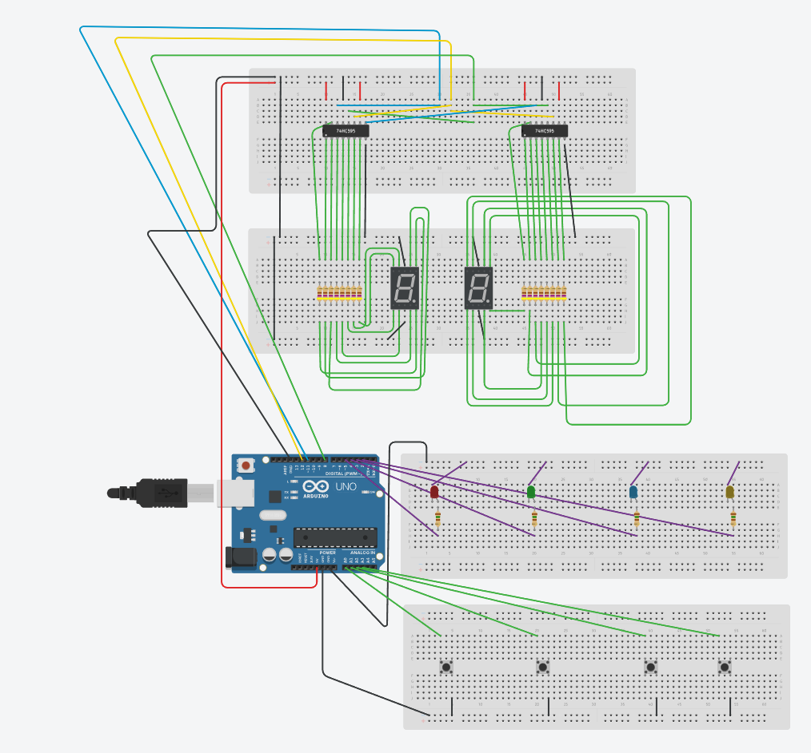

# Speden Spelit Arduino-game

## Project Overview

In this project, we are recreating the classic Finnish reaction game from the TV show **"Speden Spelit."** This nostalgic game tests players' reaction times and memory by lighting up an LED in a random sequence. Players must then press the corresponding button to match the light.

As gameplay progresses, the challenge intensifies with increasing speed, making it harder to keep up and score points. The current score is displayed on 7-segment displays, providing real-time feedback on performance.

This project is part of our school microcontroller course, where we apply our knowledge in a hands-on manner. The key components include buttons, LEDs, 7-segment displays, and game logic, all seamlessly controlled by an Arduino microcontroller. 

Through this project, we have learned about integrating hardware and software while developing our programming skills.

## Table of Contents
- [Features](#features)
- [Hardware Requirements](#hardware-requirements)
- [Software Requirements](#software-requirements)
- [Setup](#setup)
- [Circuit Diagrams](#circuit-diagrams)
- [Flowcharts](#flowcharts)
- [Authors](#authors)

## Features

- **4 Buttons**: For user controls.
- **4 LED Lights**: Lights to indicate the next button to press.
- **7-Segment Displays**: To show the current score and/or high score.
- **Interrupt-Driven Logic**: Buttons and timers utilize interrupts.
- **Difficulty Change**: The speed of LEDs increases as the game progresses.

## Hardware Requirements
To replicate this project, you will need the following components:

- 1 x Arduino (Uno or compatible)
- 4 x Push Buttons
- 4 x LEDs
- 2 x 74HC595 Serial-to-Parallel Shift Registers
- 2 x 7-Segment Displays
- Resistors and wires
- Breadboard

## Software Requirements

- Arduino IDE
- Tinkercad

## Setup
Instructions for setting up and preparing project for use:

1. Clone the repository:
    ```bash
    git clone https://github.com/kayttaja/speden-pelit.git
    ```
2. Download project files into your Arduino IDE -programming environment.
3. Correctly plug in your Arduino and upload the code into the device.

## Käyttöohjeet
Lyhyet ohjeet pelin käyttämiseen lisätään tähän.

## Kansiomalli
Tähän voit kuvata projektin kansiorakenteen.

## Circuit Diagrams

Here is the circuit diagram in Tinkercad:



You can also download a detailed circuit diagram in PDF format [from this link](Images/circuit_diagram.pdf).

## Flowcharts
Here is the flowchart about gamelogic:


## Authors
Tähän voit lisätä projektin tekijöiden nimet ja yhteystiedot.
